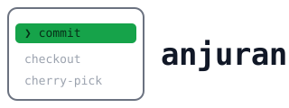

<p align="center">
  
</p>

<p align="center">
  <em>Shell autocomplete that works over SSH — inline ANSI, no overlay.</em>
</p>

<p align="center">
  <a href="https://github.com/ufhy/anjuran-cli/actions/workflows/ci.yml"></a>
  <a href="https://github.com/ufhy/anjuran-cli/releases"></a>
  
  
  <a href="LICENSE"></a>
</p>

---

Autocomplete untuk shell, lintas platform, digambar langsung di dalam terminal.

Mengetik `git ` lalu spasi memunculkan daftar subcommand beserta keterangannya.
Menekan `/` memunculkan isi direktori. Memilih sebuah folder langsung membuka
isinya. Semuanya tergambar di baris bawah prompt dengan ANSI biasa — bukan
jendela melayang — sehingga ikut jalan lewat SSH, tmux, dan `docker exec`.

```
$ git
╭─────────────────┬────────────────────────────────────────────────────────────╮
│ ❯ ▪ add         │ Add file contents to the index                             │
│   ▪ apply       │ Apply a patch to files and/or to the index                 │
│   ▪ archive     │ Create an archive of files from a named tree               │
│   ▪ bisect      │ Use binary search to find the commit that introduced a bug │
╰─────────────────┴───────────────────────────────────────────────────── 1/56 ─╯
```

## Pemasangan

```sh
curl -fsSL https://raw.githubusercontent.com/ufhy/anjuran-cli/main/install.sh | sh
```

```powershell
irm https://raw.githubusercontent.com/ufhy/anjuran-cli/main/install.ps1 | iex
```

Tanpa sudo. Semuanya dipasang di bawah rumah pengguna (`~/.local` di Unix,
`%LOCALAPPDATA%` di Windows), checksum diperiksa, dan satu baris integrasi
ditulis ke berkas konfigurasi shell yang sesuai. Menjalankannya dua kali tidak
menumpuk apa pun.

Lalu buka sesi shell baru.

Memperbarui nanti:

```sh
anjuran update          # ke rilis terbaru
anjuran update --check  # lihat dulu tanpa memasang
```

Yang diperbarui bukan hanya binary: spec dan tambalan ikut, karena keduanya
berpasangan dengan versinya. Pemasangan lewat pengelola paket dilewati —
perbaruilah dengan pengelola itu.

<details>
<summary>Cara lain</summary>

Unduh arsip dari [halaman rilis][rilis], letakkan `anjuran` di dalam PATH, dan
biarkan `specs/` bersebelahan dengannya. Lalu satu baris di berkas konfigurasi
shell:

| Shell | Baris |
|---|---|
| zsh | `eval "$(anjuran init zsh)"` |
| bash | `eval "$(anjuran init bash)"` |
| fish | `anjuran init fish \| source` |
| PowerShell | `anjuran init powershell \| Out-String \| Invoke-Expression` |

Tersedia juga paket `.deb`, `.rpm`, dan `.apk`.

Untuk memasang versi prarilis tertentu:

```sh
ANJURAN_VERSION=v0.1.0-beta.1 curl -fsSL https://raw.githubusercontent.com/ufhy/anjuran-cli/main/install.sh | sh
```

</details>

## Cara memakainya

Kotak muncul ketika sebuah kata **selesai** ditulis, bukan sambil mengetik:

| Tombol | Yang terjadi |
|---|---|
| spasi | menutup sebuah kata → kotak muncul |
| `/` | menutup satu komponen path → isi direktori muncul |
| `=` | menutup nama sebuah opsi → nilainya ditawarkan |
| Tab | memunculkan kotak kapan saja |

Di dalam kotak:

| Tombol | Yang terjadi |
|---|---|
| ↑ ↓ | berpindah baris |
| Enter | memakai yang tersorot |
| → | masuk ke dalam folder yang tersorot |
| ⏎ pada baris pertama | berhenti memilih, pakai path apa adanya |
| Tab | menyisipkan awalan terpanjang yang sama |
| Esc | menutup tanpa mengubah apa pun |
| Ctrl-A, Home, End, ← | memindahkan kursor dan menutup kotak |

Matikan pemicu otomatis dengan `ANJURAN_AUTO=0`; Tab tetap jalan.

## Yang didukung

Keempat shell mendapat fitur yang sama, dan itu diuji — bukan diasumsikan.

| | zsh | bash | fish | PowerShell |
|---|---|---|---|---|
| Tab | ✓ | ✓ | ✓ | ✓ |
| pemicu spasi `/` `=` | ✓ | ✓ | ✓ | ✓ |
| turun ke dalam folder | ✓ | ✓ | ✓ | ✓ |
| pemekaran alias | ✓ | ✓ | ✓ | ✓ |
| tombol kursor | ✓ | ✓ | ✓ | ✓ |
| mode vi | ✓ | ✓ | ✓ | ✓¹ |
| saran dari riwayat | sendiri | — | bawaan fish | bawaan PSReadLine |

¹ Di PowerShell, `Set-PSReadLineOption -EditMode Vi` harus berada **sebelum**
baris anjuran di profilmu. PSReadLine menolak mendaftarkan tombol untuk mode
yang belum aktif, jadi kalau urutannya terbalik seluruh tombol anjuran hilang
tanpa satu pun pesan. Di bash urutannya tidak penting: `set -o vi` boleh di
mana saja.

Saran dari riwayat dinyalakan dengan `ANJURAN_GHOST=1`. Di fish dan PowerShell
yang dipakai fitur bawaan shell-nya, karena miliknya lebih baik dan menirunya
hanya membuat dua teks abu-abu bertumpuk. bash tidak punya padanannya:
readline tidak menyediakan kait per-ketikan maupun tempat menggambar teks di
luar buffer.

Platform: Linux, macOS, dan Windows; amd64 dan arm64.

## Sumber kandidat

- **716 perintah** dari korpus spec [withfig/autocomplete][fig] (MIT), 1.472
  berkas — git, docker, kubectl, aws, npm, dan seterusnya
- **19 tambalan tulisan tangan** untuk yang tidak ada di sana atau salah di
  sana: `cd`, `ssh`, `docker`, `kubectl`
- **skrip proyek** dibaca dari manifesnya: `package.json`, `deno.json`,
  `composer.json`, `Makefile`, `justfile` — sehingga `bun run ` menawarkan
  skrip yang memang ada di proyek itu
- **isi PATH** untuk nama perintah

### Generator

Sebagian spec menawarkan kandidat dengan **menjalankan perintah** — misalnya
`kubectl get pods`. Itu efek samping dari mengetik, jadi kebijakannya ketat:

- interpreter (`bash -c`, `python`, `sudo`) **selalu ditolak**, tanpa
  pengecualian — 194 spec dalam korpus Fig memuatnya
- hanya perintah yang sedang kamu ketik sendiri yang boleh dijalankan
- ada batas waktu, dan hasilnya di-cache

| Lingkungan | Arti |
|---|---|
| `ANJURAN_NO_GENERATORS` | matikan seluruh generator |
| `ANJURAN_GENERATOR_ALLOW` | biner tambahan yang boleh dijalankan, dipisah koma |
| `ANJURAN_GENERATOR_ALLOW_ROOT` | izinkan generator berjalan sebagai root |
| `ANJURAN_GENERATOR_TIMEOUT` | batas waktu, misalnya `800ms` |

## Memasang ke host lain

```sh
anjuran up deploy@web-01
```

Mengirim binary dan spec ke host itu lewat SSH, lalu menulis baris integrasi ke
berkas konfigurasi shell **login** pengguna di sana. Engine harus berjalan di
sisi remote: generator seperti `kubectl get pods` hanya menjawab benar di
tempat datanya berada.

Ini bukan pembungkus ssh. Dijalankan sekali, dengan sadar, lalu selesai.

| Opsi | Arti |
|---|---|
| `--from <dir>` | ambil binary dari direktori ini |
| `--dry-run` | tampilkan rencananya tanpa mengirim apa pun |
| `--no-shell` | jangan sentuh berkas konfigurasi shell di sana |
| `--base <dir>` | direktori tujuan, relatif terhadap rumah pengguna |

Opsi milik anjuran ditulis **sebelum** host; apa pun setelah host diteruskan ke
`ssh`, sehingga `-p 2222` dan `-i kunci` bekerja seperti biasa.

Kalau platform host berbeda dari mesinmu, anjuran mencari binary yang sudah
dibangun, lalu **mengunduh berkas rilis** untuk platform host — versi yang
sama persis dengan yang terpasang di mesinmu, checksum diperiksa — lalu
membangunnya sendiri bila perintah ini dijalankan dari dalam pohon sumber.
Untuk jaringan tertutup, pakai `--from`. Tidak pernah memakai sudo di host
tujuan.

**Host Windows belum ikut diunduh otomatis.** Arsip rilis Windows berbentuk
zip, dan pembongkarnya belum ada — jadi untuk host Windows sebutkan sendiri
sumbernya dengan `--from <direktori>`. Semua langkah lain berjalan seperti
biasa. Lihat [#5](https://github.com/ufhy/anjuran-cli/issues/5).

## Lingkungan

| Lingkungan | Arti |
|---|---|
| `ANJURAN_AUTO` | `0` mematikan kotak yang muncul sendiri (bawaan: nyala) |
| `ANJURAN_KEY` | tombol pemicu, dibaca skrip init |
| `ANJURAN_GHOST` | `1` menyalakan saran dari riwayat |
| `ANJURAN_IKON` | `nerd` untuk glyph Nerd Font, `0` untuk mematikan ikon |
| `ANJURAN_SIMPLE` | matikan warna dan sorotan |
| `ANJURAN_SPECS` | direktori spec |
| `ANJURAN_CACHE_DIR` | lokasi cache generator dan ingatan pilihan |
| `ANJURAN_LOG` | rekam byte yang digambar, untuk menyelidiki layar yang aneh |
| `ANJURAN_RELEASE_URL` | asal berkas rilis, untuk cermin atau jaringan tertutup |

## Pengembangan

```sh
make check      # fmt, vet, test
make specs      # bangun korpus spec dari paket npm Fig
make ux         # skenario UX di dalam zsh sungguhan
make cross      # binary untuk enam platform
make snapshot   # rilis percobaan tanpa menerbitkan apa pun
```

`specs/` tidak masuk git; ia dihasilkan `make specs` dan butuh Node.

Engine adalah fungsi murni — baris perintah dan posisi kursor masuk, kandidat
keluar — sehingga bisa diuji tanpa terminal sama sekali. Yang OS-specific hanya
`internal/shellinit/`, dan itu diuji dengan menjalankan shell sungguhan di
dalam container: bash, zsh, fish di Debian, dan PowerShell di image arm64
tersendiri.

Skrip pemasang diuji dua lapis: sintaks pada setiap commit, lalu pemasangan
sungguhan dari rilis yang sudah terbit — di dash, busybox ash, macOS, Windows
amd64 dan arm64 — setiap rilis dan setiap minggu.

## Lisensi

MIT. Korpus spec berasal dari [withfig/autocomplete][fig], juga MIT; lihat
[NOTICE](NOTICE).

[fig]: https://github.com/withfig/autocomplete
[rilis]: https://github.com/ufhy/anjuran-cli/releases
